# Public Report #0134 Stolen 100 ETHs Leads to NFT Whales (25mln$ worth) and a real company (6mln$ investments and 50mln$ coin cap) | undeads.com was funded with dirty money from investors

**The report:**

* **Author:** Crypto Karl, a crypto detective, [@cryptokarl013](https://github.com/cryptokarl013);
* **Last updated:** July 25, 2025;
* **Version:** 1.0.3;
* **Category:** investigation of a crypto theft.

> [!NOTE]
> _**Update July 10, 2025:** some information started being changed after publishing the report. For example, links between Indifferent.eth and N0b0dy.eth removed from undeads.com crunchbase portal. Refer to original screenshots or web archives._

> [!IMPORTANT]
> For any further clarification regarding the current investigation, please contact @github/cryptokarl013. Any assistance that helps enrich the investigation would be greatly appreciated.
> The report's content is based on verifiable public information.

## Keywords

[switchere.com](http://switchere.com), indifferent.eth, n0b0dy.eth, [undeads.com](http://undeads.com), Sezual PTE. LTD., Undeads Interactive Limited.

## Abstract

In May 2022, over 100 ETH were stolen from a hot wallet of the [switchere.com](http://switchere.com) crypto exchange. By 2025, these stolen funds were traced to NFT whales __Indifferent.eth__ and __N0b0dy.eth__, who hold assets worth over $25 million.

It's highly probable that n0b0dy.eth and indifferent.eth are managed by a single person or a coordinated group.

There is a connection to [Undeads.com](http://undeads.com), a legitimate company that has received more than $2 million in investments from Indifferent.eth and N0b0dy.eth.

[Undeads.com](http://undeads.com) is owned by Sezual PTE. LTD., a company based in Singapore. They have their own cryptocurrency coin UDS, which is actively traded and listed on [CoinMarketCap.com](http://coinmarketcap.com). As of June 2025, the market capitalization of UDS is approximately $50 millions.

[undeads.com](http://undeads.com) company cap may be affected with dirty money from the n0b0dy.eth and indifferent.eth.

The Breadcrumbs Report: [https://www.breadcrumbs.app/reports/17067?share=df899b2c-9c8a-4ee2-9120-17c8c430c85c](https://www.breadcrumbs.app/reports/17067?share=df899b2c-9c8a-4ee2-9120-17c8c430c85c) 

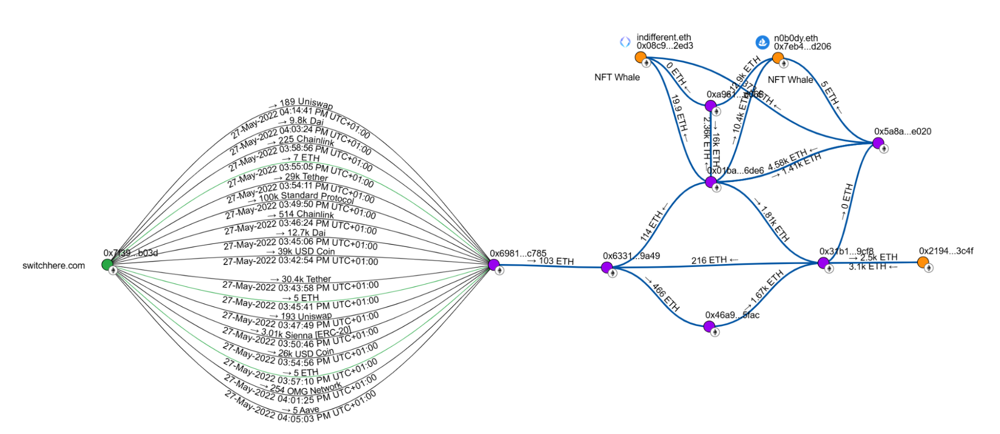

| # | Hypotheses | Confidence | Comments |
|---|---|---|---|
| 1 | n0b0dy.eth and indifferent.eth, being "NFT whales," are managed by a single person or a coordinated group | 99% | The EVM-addresses have direction connections with each other  |
| 2 | n0b0dy.eth and indifferent.eth are connected with crypto thefts including the switchere.com case | 95% | Based on the eth addresses analysis  |
| 3 | Nobody.eth and Indifferent.eth are either the founders of Undeads.com or are closely connected with them. | 80% | Investors put millions into a company only when they have strong confidence in its founders. This makes the current lack of public information about the founders a significant point of consideration. What's more, the pre-seed and seed funding rounds only included two investors: Nobody.eth and Indifferent.eth.  |
| 4 | undeads.com hides official personal and company information intentionally The Undeads.com website does not provide information about the jurisdiction of a legal company. The founders of undeads.com do not have public accounts in social networks under undeads.com label. The Undeads company LinkedIn profile has only one open employee profile. All others are closed including C-level. | 70% | Hard to find information about legal company, founders, C-Level, employees  |
| 5 | The company has harmful intentions towards its community | 15% | This is solely the analyst's subjective intuition; no facts were found to confirm the hypothesis.  |

### Concerns Regarding Undeads.com Funding 

There are allegations that Undeads.com has been funded with illicit money provided by investors Nobody.eth and Indifferent.eth.

## Investigation

### Theft fact

The EVM address [0x7f399e3c77c38c6571ff7114dc90a53357eab03d](https://etherscan.io/address/0x7f399e3c77c38c6571ff7114dc90a53357eab03d) was identified as an output hot wallet belonging to the crypto exchange [Switchere.com](http://switchere.com).

On May 27, 2022, Ethereum and 13 other EVM-compatible coins were transferred to a new, "clean" wallet [0x6981fe4eb847c9060861c24b3a1463ebd8b3c785](https://etherscan.io/address/0x6981fe4eb847c9060861c24b3a1463ebd8b3c78). The hot wallet was completely emptied within several hours.

The funds were withdrawn as a result of a hacker attack on switchere.com, after which the crypto exchange changed its hot wallets.

### Related wallets

All the coins held at the address [0x6981fe4eb847c9060861c24b3a1463ebd8b3c785](https://etherscan.io/address/0x6981fe4eb847c9060861c24b3a1463ebd8b3c78) were converted into Etherium. As a result >103 ETHs (216K$ in June 2022) were transferred to the [0x63312e37edcaacb21eb597323956d697821d9a49](https://etherscan.io/address/0x63312e37edcaacb21eb597323956d697821d9a49) address.

The [0x63312e37edcaacb21eb597323956d697821d9a49](https://etherscan.io/address/0x63312e37edcaacb21eb597323956d697821d9a49) wallet has funded from the address [0x01baea860c7661561c31b1f765cfe8e064ff6de6](https://etherscan.io/address/0x01baea860c7661561c31b1f765cfe8e064ff6de6) that also funded big NFT Whales [@n0b0dy.eth](https://web3.bio/n0b0dy.eth) (0x7eb413211a9de1cd2fe8b8bb6055636c43f7d206) and [@indifferent.eth](https://web3.bio/indifferent.eth) (0x7eb413211a9de1cd2fe8b8bb6055636c43f7d206).

The linked addresses [@n0b0dy.eth](https://web3.bio/n0b0dy.eth) and [@indifferent.eth](https://web3.bio/indifferent.eth) are believed to belong to a single individual or group.

All of these disclosed addresses are managed manually and crypto circulates around them: 

* [0x01baea860c7661561c31b1f765cfe8e064ff6de6](https://intel.arkm.com/explorer/address/0x01baeA860C7661561c31B1F765CfE8e064fF6De6) (Arkm detects it as nobody_vault) 
* [0x5a8af490848d43d74f9d848ec14a7319494ae020](https://intel.arkm.com/explorer/address/0x5a8af490848d43d74f9d848ec14a7319494ae020) ([Noticed in thefts](https://x.com/ElwoodFox4/status/1782344348153344139)) 
* 0x46a93a8d4440df32d2b13c03baecad28d3df5fac 
* 0x31b13fa1c6e786854f62fd0d6cb41d9b64639cf8 
* 0x2194f90d32df768c9bfdbd3215d677eaa6fc3c4f (21mln$ worth in Jan 2025) 
* 0xa9615dfa74c79b38ee144169b5e87dfba43ed066 
* [0x08c904a02578ed95a46c25a8cc510cd6ed9f2ed3](https://intel.arkm.com/explorer/address/0x08c904A02578ed95a46C25A8cC510CD6eD9F2ed3) (indifferent.eth, indifferentguy.eth, 23mln$ in Jun 2025) 
* [0x7eb413211a9de1cd2fe8b8bb6055636c43f7d206](https://intel.arkm.com/explorer/address/0x7eb413211a9DE1cd2FE8b8Bb6055636c43F7d206) (n0b0dy.eth, kfox.eth, 2.3mln$ in Jun 2024) 

The Breadcrumb report visualizes the connections between addresses: [https://www.breadcrumbs.app/reports/17067?share=df899b2c-9c8a-4ee2-9120-17c8c430c85c](https://www.breadcrumbs.app/reports/17067?share=df899b2c-9c8a-4ee2-9120-17c8c430c85c) 

⚡ One of the addresses 0x5a8af490848d43d74f9d848ec14a7319494ae020 has been implicated in other thefts. The link: [https://x.com/ElwoodFox4/status/1782344348153344139](https://x.com/ElwoodFox4/status/1782344348153344139).

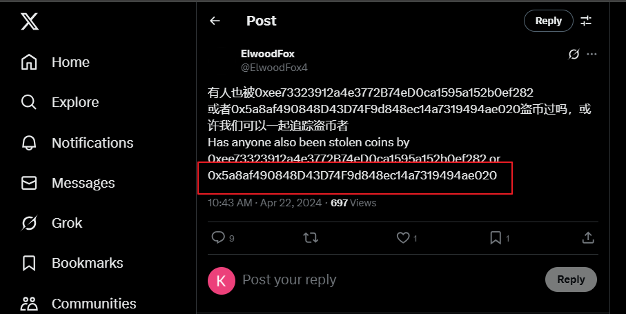

**Conclusions:**

* n0b0dy.eth and indifferent.eth, being "NFT whales," are managed by a single person or a coordinated group 
* n0b0dy.eth and indifferent.eth are connected with crypto thefts including the switchere.com case 

### Undeads.com

According to Crunchbase, [Undeads.com](http://undeads.com) has only two listed investors, n0b0dy.eth and indifferent.eth, and has successfully raised $6.3 million in funding through its Pre-Seed and Seed rounds.

**Links:**

* [undeads.com](http://undeads.com) profile - [https://www.crunchbase.com/organization/undeads-fze-llc](https://www.crunchbase.com/organization/undeads-fze-llc) 
* n0b0dy.eth profile - [https://www.crunchbase.com/person/n0b0dy-eth-nobody-vault](https://www.crunchbase.com/person/n0b0dy-eth-nobody-vault) 
* indifferent.eth profile - [https://www.crunchbase.com/person/indifferentguy-eth-indifferentguy](https://www.crunchbase.com/person/indifferentguy-eth-indifferentguy) 

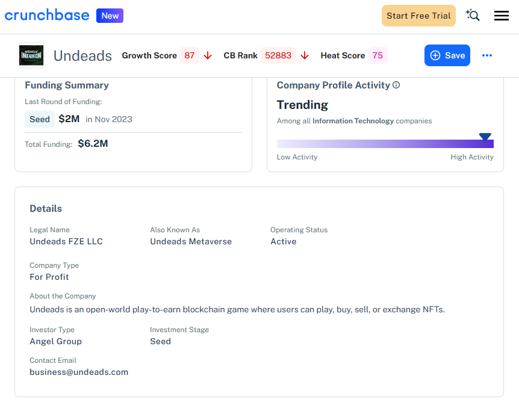

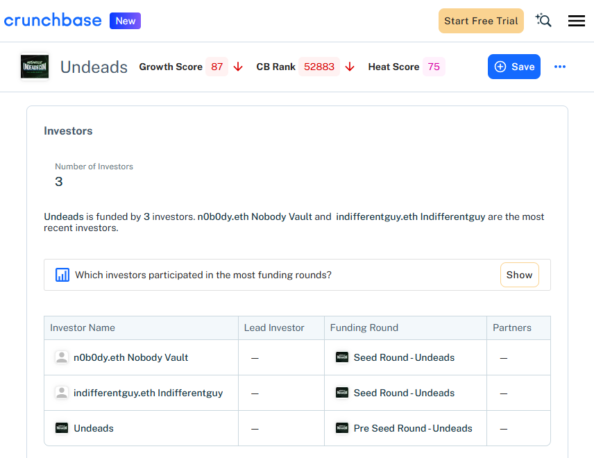

The Undeads.com website identifies Sezual Pte Ltd as its legal entity but provides no information regarding its specific jurisdiction or operational residence.

**Links:** [https://undeads.com/legal/terms](https://undeads.com/legal/terms) 

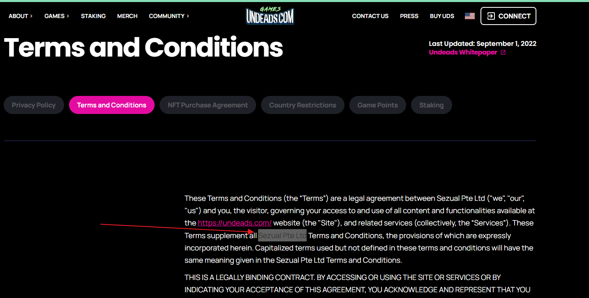

@undeadscom ([https://x.com/undeadscom](https://x.com/undeadscom)) twitter discloses that a based Sezual Pte Ltd company is registered in Singapore.

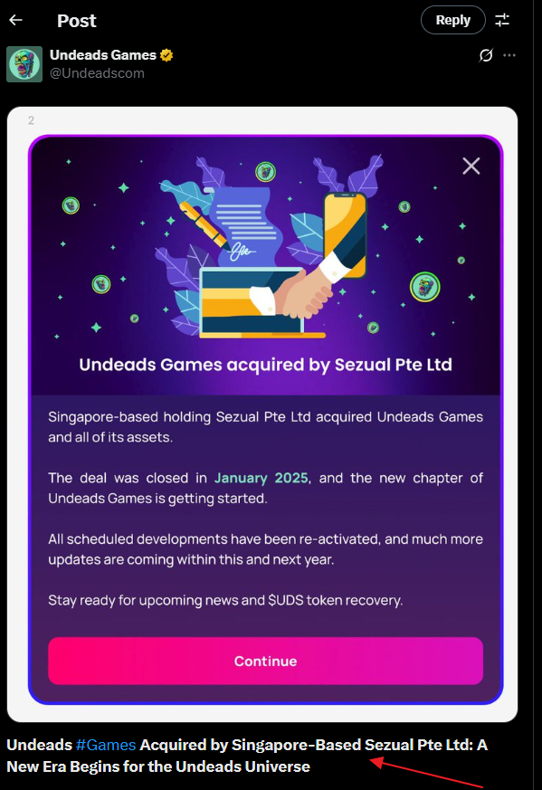

Officially, the SEZUAL PTE. LTD. company is listed as a software developer, but it specifically excludes games, which is an unusual classification given its activities:

SEZUAL PTE. LTD. (the "Company") is an Exempt Private Company Limited by Shares, incorporated on 26 July 2010 (Monday) in Singapore. The address of the Company's registered office is at the [HONG LEONG BUILDING](https://www.sgpbusiness.com/building/HONG-LEONG-BUILDING/048581) building. The Company current operating status is live and has been operating for 1280129618. This Company's principal activity is development of software and applications (except games and cybersecurity).

**Key Principal:** YEOW LIH REN 

**Previous Company Name:** TELEOS CORPORATE PTE. LTD. 

* [https://www.sgpbusiness.com/company/Sezual-Pte-Ltd](https://www.sgpbusiness.com/company/Sezual-Pte-Ltd) 
* [https://www.dnb.com/business-directory/company-profiles.sezual_pte_ltd.e65e611ea6bd54cb6efc89e43f986f42.html](https://www.dnb.com/business-directory/company-profiles.sezual_pte_ltd.e65e611ea6bd54cb6efc89e43f986f42.html) 

Until Sezual Pte Ltd company (Singapore) is considered as a main equity, the company Undeads Interactive Limited (London) is a publisher.

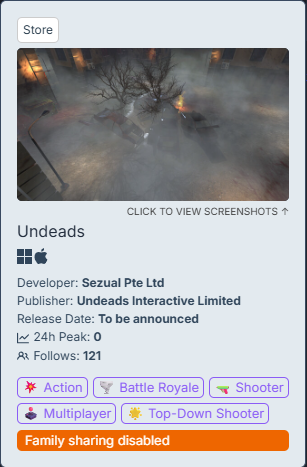

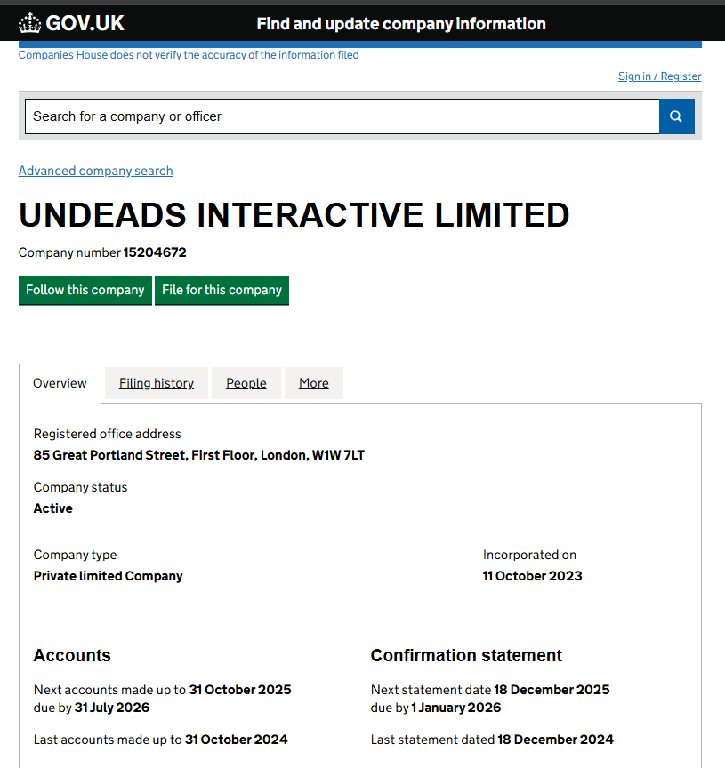

The Undeads LinkedIn account states about Headquarters in the United Arab Emirates.

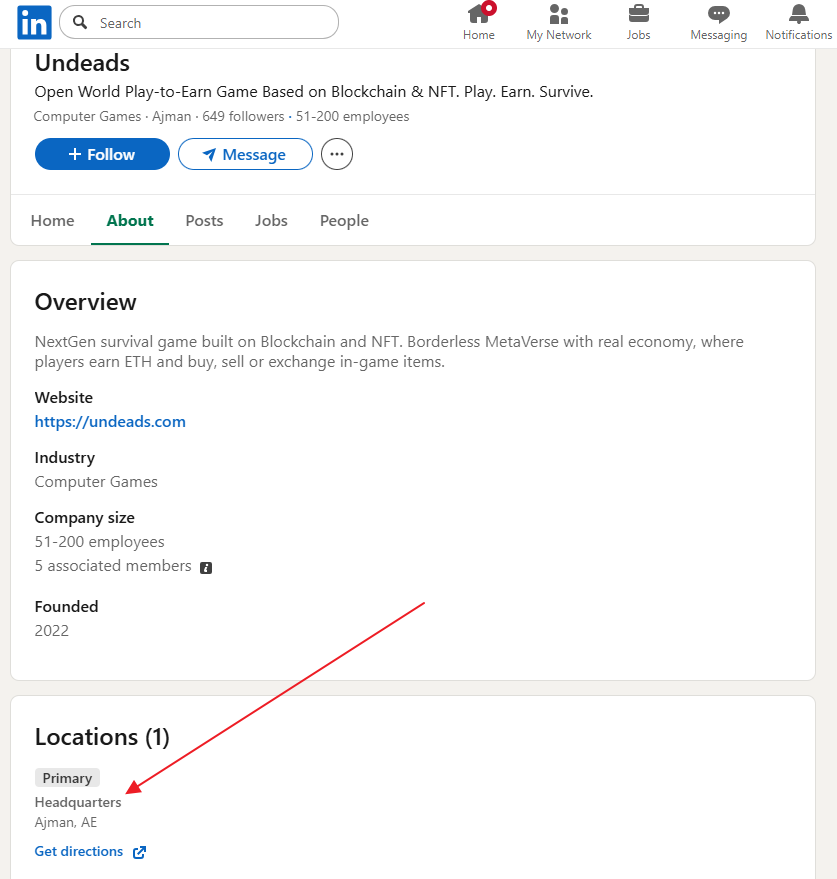

[Undeads.com](http://undeads.com) has their own coin UDS that is listed on [coinmarketcap.com](http://coinmarketcap.com) and other crypto exchanges. Market Cap: ~$50M in June 2025.

The link: [https://coinmarketcap.com/currencies/undeads-games/](https://coinmarketcap.com/currencies/undeads-games/) 

Despite receiving millions in investments and their coin having a market cap of $50 million, [Undeads.com](http://undeads.com) lacks clear, official legal entity information. This makes determining the proper jurisdiction for complaints difficult, as various entities are mentioned: Sezual Pte Ltd (Singapore), Undeads Interactive Limited (London), and a headquarters in the UAE.

### Hidings in [Undeads.com](http://undeads.com)

The publicly named founders of Undeads.com, Grant Haseley and Leo Kahn, do not appear to have official accounts in social networks directly affiliated with the "undeads.com" label.

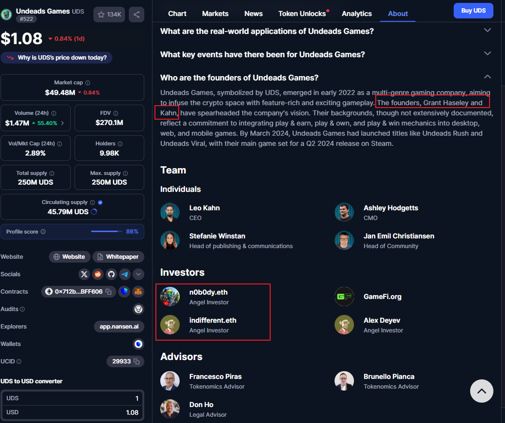

**Grant Haseley (Founder, USA)** 

* Personal Facebook account (no undeads mentioned except t-shirt undeads logo on a photo) - [https://www.facebook.com/grant.haseley](https://www.facebook.com/grant.haseley) 
* LinkedIn: [https://www.linkedin.com/in/grant-haseley-116a2398/](https://www.linkedin.com/in/grant-haseley-116a2398/) (Vice President - FP&A, Data Analytics & Modernization at M&T Bank, no undeads mentioned) 
* No searchable [X.com](http://x.com) accounts 

**Leo Kahn (Founder, CEO, USA)** 

* No searchable LinkedIn, Facebook, [X.com](http://x.com) accounts 
* Just a couple videos from conferences - [https://www.facebook.com/watch/?v=1002586494443152&rdid=9FWHCUvtOp07cB39](https://www.facebook.com/watch/?v=1002586494443152&rdid=9FWHCUvtOp07cB39) 

It's unusual for a company of Undeads' stated size (50+ employees) to have only one publicly visible employee profile on LinkedIn, with all others hidden or private (including accounts of C-level). This is atypical for businesses aiming for transparency and professional networking.

The link: [https://www.linkedin.com/company/undeadscom/](https://www.linkedin.com/company/undeadscom/) 

This is the LinkedIn profile of the CEO of Undeads.com:
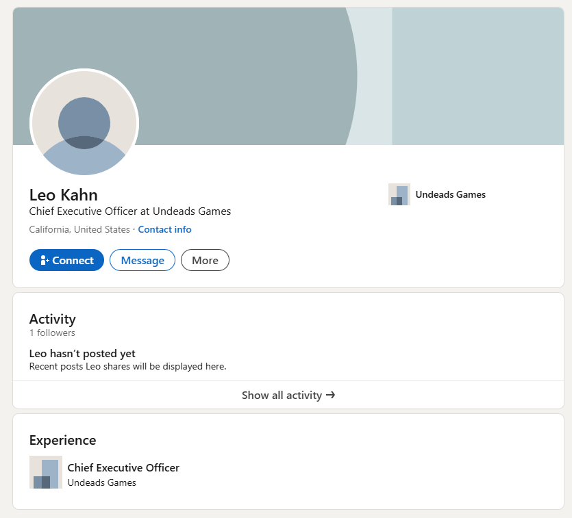

Here are the other individuals whose real identities have been disclosed: 

* Roman Roshchuk (position: unknown, Ukraine) - [https://x.com/roshchuck](https://x.com/roshchuck) 
* Konstantin Vinogradov (UX Designer) - [https://www.linkedin.com/in/cryptodesigner/](https://www.linkedin.com/in/cryptodesigner/) 
* Julija Gorska (Director of UNDEADS INTERACTIVE LIMITED) - [https://find-and-update.company-information.service.gov.uk/officers/1jv2YxrvVmteUvtWa9thPZQBxNU/appointments](https://find-and-update.company-information.service.gov.uk/officers/1jv2YxrvVmteUvtWa9thPZQBxNU/appointments) 
* Vasil Dimitrov (Ex-Director of UNDEADS INTERACTIVE LIMITED) - [https://find-and-update.company-information.service.gov.uk/officers/Kfuhx6hTqxkHl0cuCF0QYabbhIE/appointments](https://find-and-update.company-information.service.gov.uk/officers/Kfuhx6hTqxkHl0cuCF0QYabbhIE/appointments) 

❗️It's certainly a pertinent question for investors and the public alike. A company like Undeads, boasting millions in investments and a significant market cap >$50mln for its coin, yet maintaining a high degree of public opacity, raises several red flags and questions about its operational model.

## Key Assumptions from the Investigation

This investigation leads to several assumptions: 

* There's a possible link between stolen funds from [Switchere.com](http://switchere.com) and the investors Nobody.eth and Indifferent.eth.
* Nobody.eth and Indifferent.eth, both prominent NFT whales, appear to be controlled by a single individual or a coordinated group.
* There is a confirmed connection to [Undeads.com](http://undeads.com), a seemingly legitimate company that has received at least $2 million in investments from Indifferent.eth and Nobody.eth.
* The market cap of [Undeads.com](http://undeads.com) may be inflated or influenced by illicit funds originating from Nobody.eth and Indifferent.eth.
* Specifically, Undeads.com's financial standing may be tainted by dirty, stolen money from these investors.

## Donations

Donations to support this and future investigations are welcome at the following ETH address: 0x0206AfA1A71cc833b8ade7a94748b6638798F193.

For any further clarification regarding the current investigation, please contact [@cryptokarl013](https://github.com/cryptokarl013). Any assistance that helps enrich the investigation would be greatly appreciated.

* * * * * * * * * * * * * * * * * *

## Related screenshots

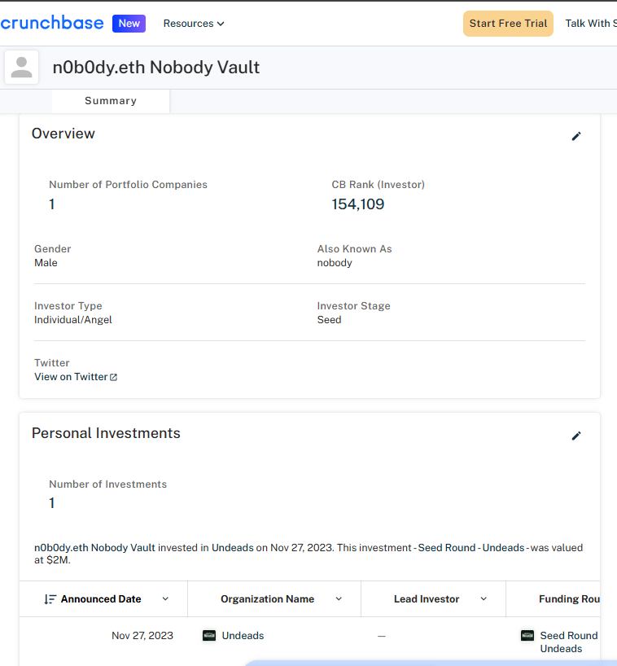

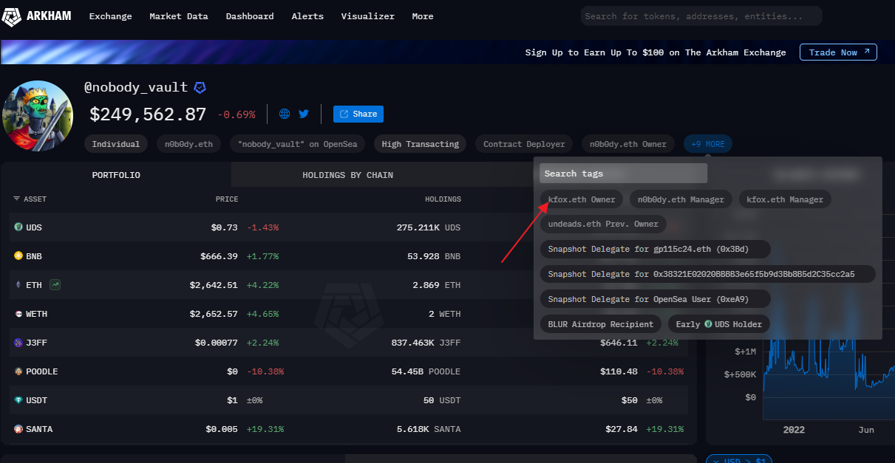

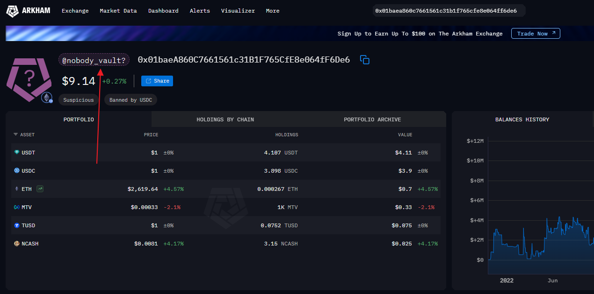

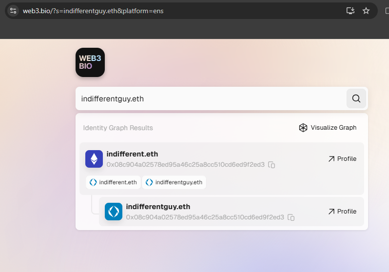

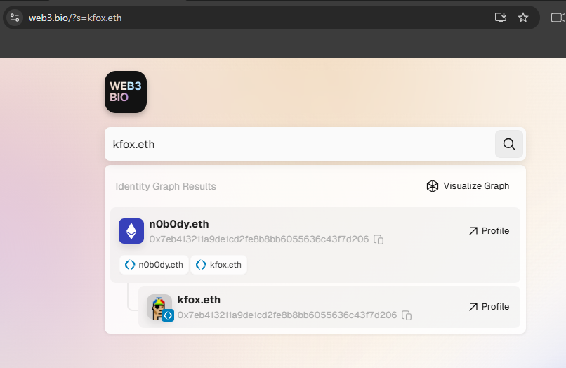

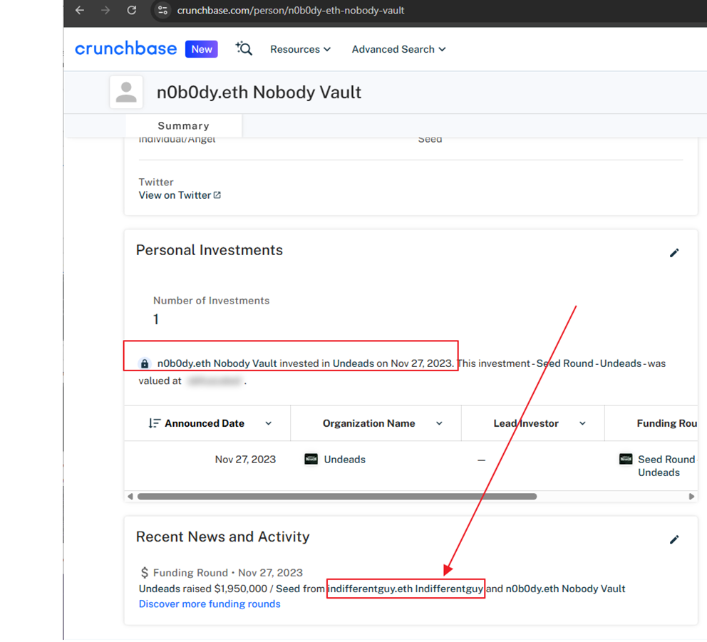

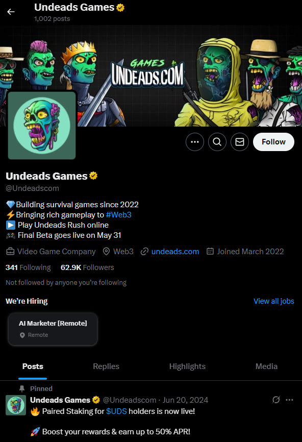

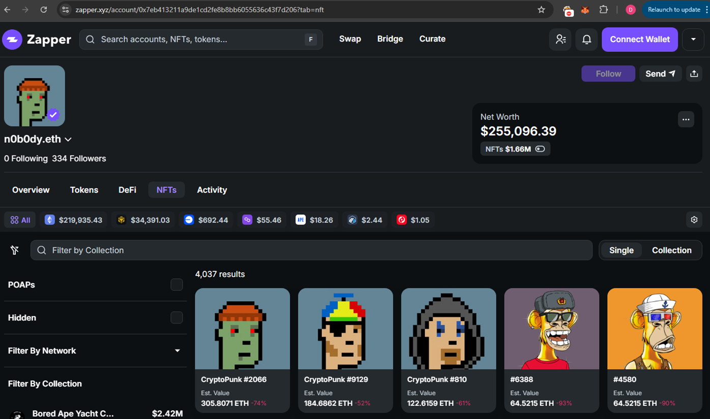

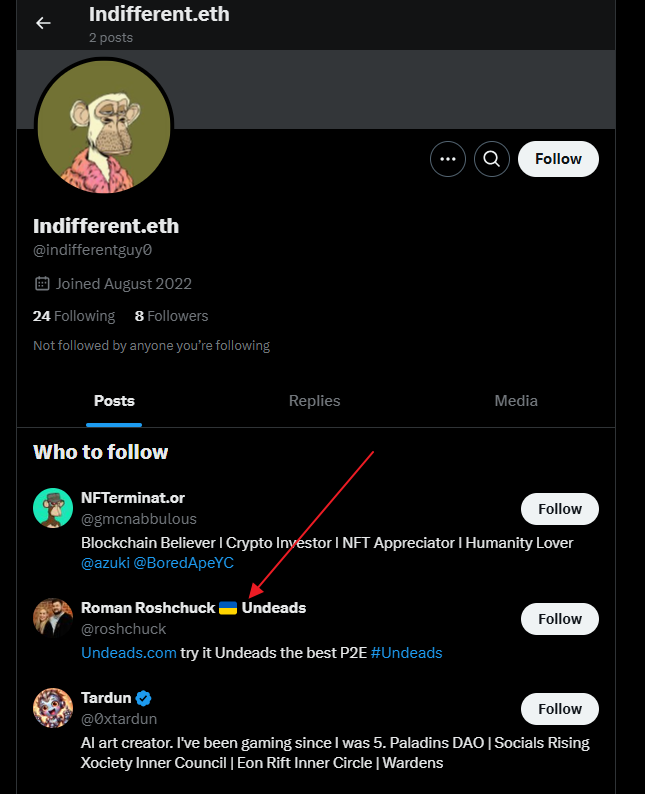

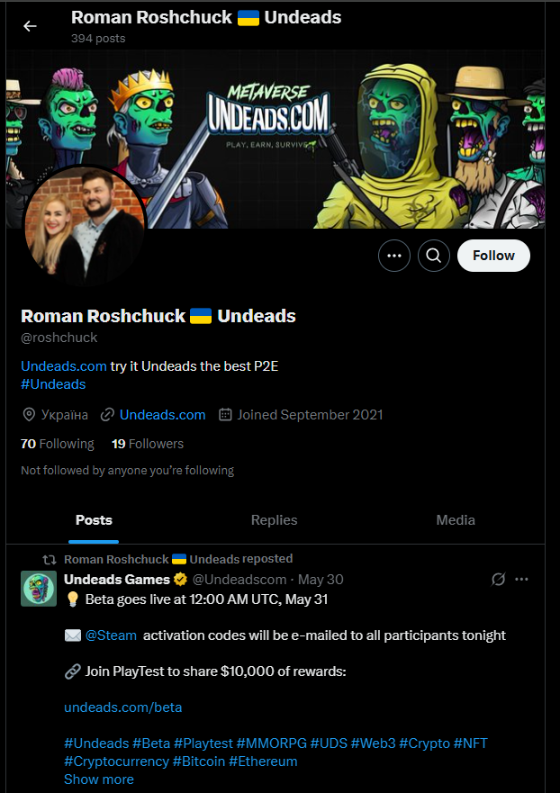

